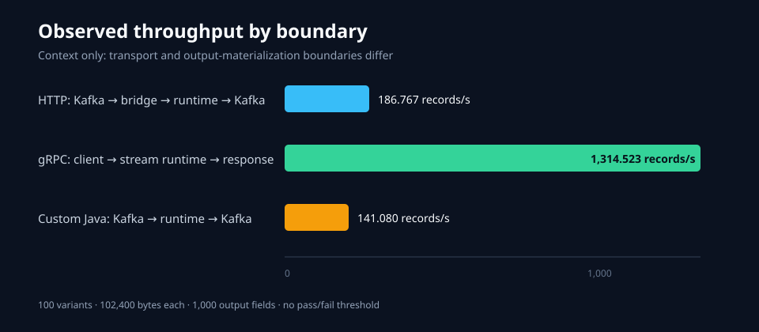

# Live runtime performance: 100 KB input and 1,000 mapped fields

This evidence family preserves measurements from an isolated benchmark campaign
run against a live local Docker stack. It covers a hard synthetic mapping, two
live runtime transports, HTTP batching, and a mapping-specific custom Java
counterfactual. No performance threshold or pass/fail verdict was applied.

The sanitized primary manifests, measurement outputs, allocation summaries, and
UI captures behind these observations are in [`primary-evidence/`](primary-evidence/README.md).

## Frozen workload identity

| Property | Value |
|---|---:|
| Payload variants | 100 |
| Serialized bytes per variant | 102,400 |
| Payload corpus SHA-256 | `ba3fc084ce067c2ef6b52b7326760889b492e6ad8dc553a0a2aecf4bf0c7a607` |
| Output fields | 1,000 |
| Core/specialized fields | 77 |
| Hard wide fields | 923 |
| Mapping SHA-256 | `007b1546713568882b12a884cdcc85031746e32855770ef0306ae3bebfd7fc31` |
| Record policies | Transformation, validation, and type mismatch route to DLQ |

The exact mapping is in
[`reproduction/runtime-performance-100kb-1000-fields/mapping/mapping.dsl`](../../reproduction/runtime-performance-100kb-1000-fields/mapping/mapping.dsl).
The one-row-per-output-field inventory is
[`operations-breakdown.csv`](operations-breakdown.csv).

## Preserved observations

| Campaign | Boundary | Records | Observed throughput | Status |
|---|---|---:|---:|---|
| [`hard-http-20260731-0805`](runs/http-500k/summary.md) | Kafka → Redpanda Connect → HTTP runtime → Kafka | 500,000 | 186.767 records/s | `MEASURED` |
| [`grpc-20260730-2317`](runs/grpc-stream-500k/summary.md) | gRPC client → bidirectional runtime stream → response | 500,000 | 1,314.523 records/s | `MEASURED` |
| [`custom-java-20260731-0937`](runs/custom-java-500k/summary.md) | Kafka → mapping-specific Java runtime → Kafka | 500,000 | 141.080 records/s | `MEASURED` |
| [`http-batch-20260731-1305`](runs/http-batch-10/summary.md) | Kafka → Redpanda batch 10 → HTTP batch runtime → Kafka | 10,000 | 142.811 records/s | `MEASURED` |
| [`http-batch50-20260731-0915`](runs/http-batch-50/summary.md) | Kafka → Redpanda batch 50 → HTTP batch runtime → Kafka | 10,000 | 141.400 records/s | `MEASURED` |

These throughput values are not one protocol leaderboard. The HTTP, gRPC, and
custom Java campaigns have different transport, acknowledgement, batching, and
output-materialization boundaries. See [methodology](methodology.md).

The [measurement-boundary diagram](charts/measurement-boundaries.svg) shows why
transform-only, Kafka-to-output, and gRPC response latency remain separate. The
[batch tail-latency chart](charts/batch-tail-latency.svg) visualizes the single
batch-10 and batch-50 observations without treating them as a qualified tuning result.

## Comparisons

- [Flowplane HTTP versus mapping-specific custom Java](comparisons/http-vs-custom-java.md)
- [HTTP batch size 10 versus 50](comparisons/batch-10-vs-50.md)
- [Runtime-output provenance](provenance.json)
- [Historical and interrupted attempts](historical-attempts.md)

## Claims not made

- No claim that gRPC is intrinsically faster than HTTP.
- No claim that batch size 50 is generally worse than batch size 10.
- No exact whole-stack B/op claim where required processes were not instrumented.
- No zero-copy comparison; the custom Java implementation materialized output bytes.
- No universal engineering-hours or dollar-savings claim.

All values apply only to the preserved fixtures, captured source state,
configuration, and local environment described in this evidence family.
